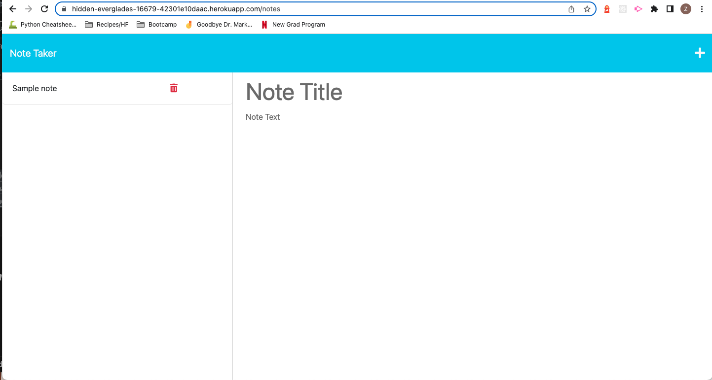
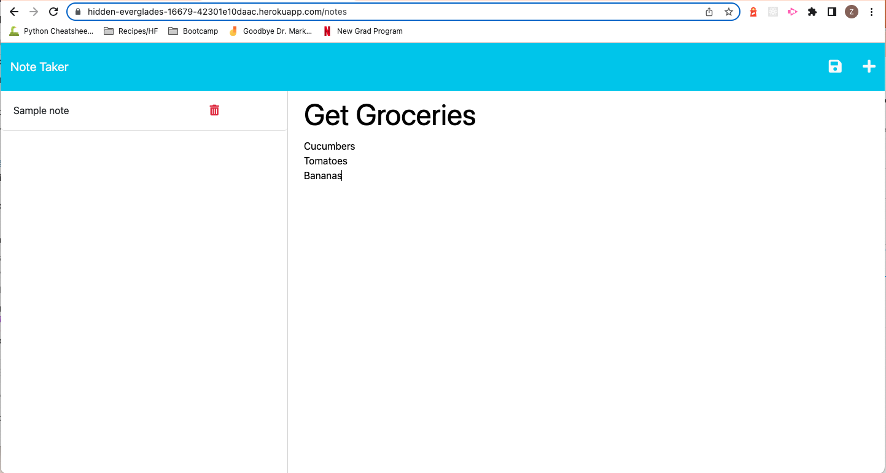
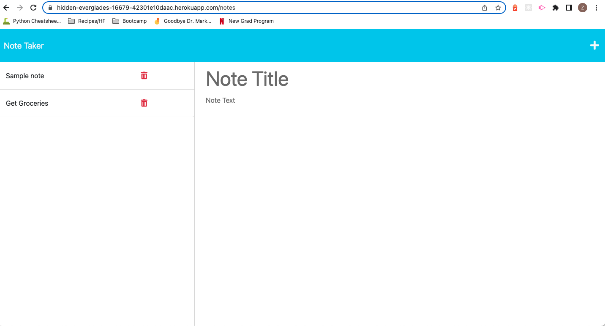

# Professional README Generator

## Description

This is a note taker app that can be used to write and save notes. This application uses an Express.js back end and will save and retrieve note data from a JSON file.

## Table of contents

- [Installation](#installation)
- [Usage](#usage)
- [License](#license)
- [Contribution](#contributing)
- [Questions](#questionsquestions)
- [Linke to Deployed App](#deployed-application)
- [Screenshots](#screenshots)

## Installation

No installation needed, write notes as needed.

## Usage

Once you navigate to the notes page, you can click the + sign to create a new note, or click on any of the previous notes to see them. Once you're done writing your note, click the save (floppy disk) icon to save your note. If you no longer need your note, click the delete (trash can) icon to remove it from your saved notes list.

## License

MIT

The MIT License is a permissive open-source license that allows users to use, modify, and distribute software under certain conditions.
      [Read more...](https://opensource.org/licenses/MIT)

## Contributing

This is an open source app. To contribute please make a branch and create a pull request

## Questions

Hi! I'm zeeDabbagh

If you have any questions please email me at dabbagh.zainab@gmail.com

And make sure to follow me on Github at https://github.com/zeeDabbagh!

## Deployed Application 

https://hidden-everglades-16679-42301e10daac.herokuapp.com/

## Screenshots

